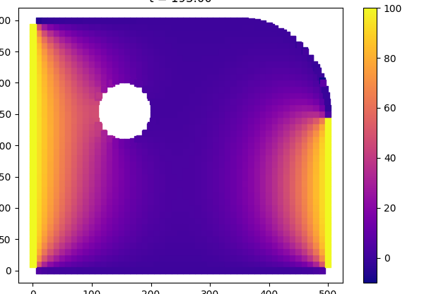

# САПР "Пластинка"

## О системе

Система может рассчитать пластину на теплопроводность одним из следующих методов:

- МКР с неявной схемой (с матрицей общего вида)
- МКР с неявной схемой и методом расслоения (с трёхдиагональной матрицей)
- МКР с явной схемой

## Описание задачи

Рассчитать пластину на теплопроводность. Заданы граничные условия 1, 2 и 3 рода.

Дифференциальное уравнение:

$$
\frac{\partial T}{\partial t} = \frac{\lambda}{c \rho}\Delta T
$$

## Описание методов решения

### Метод конечных разностей

Пусть дано ДУ в частных производных:

$$
\mathcal{L}T+P=0,
$$

где $\mathcal{L}$ - дифференциальный оператор, $T$ - фазовая переменная, $P$ - свободный член.

Чтобы решить его численными методами, можно заменить дифференциальный оператор его аппроксимацией - разностным аналогом.
Такой метод называется методом конечных разностей.

### Разностный аналог второй производной для неравномерной сетки

$$
\frac{\partial^2v}{\partial x^2}=2\frac{\mu v_C - (\mu +1)v_B + v_A}{\mu (\mu +1)\Delta x^2}
$$

### Учёт граничных условий

Граничное условие первого рода - просто константная температура, самое простое в учёте.

Граничные условия второго и третьего рода учитываются по-разному в зависимости от метода решения.

### Явный метод Эйлера

Каждая итерация явного метода Эйлера представляет собой два шага:

1. Нахождение значений фазовой переменной для внутренних узлов;
2. Нахождение значений фазовой переменной для внешних узлов.

На первом шаге для каждого внутреннего узла определяется его значение на следующем временном слое по формуле:

$$
T_{ij}^{k+1} = T_{ij}^{k} + K\cdot
\left(
K_x \cdot \left(\mu_x T_{i+1,j}^k - (\mu_x+1)T_{ij}^k + T_{i-1,j}^k\right) +
K_y\cdot\left(\mu_y T_{i,j+1}^k - (\mu_y+1)T_{ij}^k + T_{i,j-1}^k\right)
\right)
$$

где $K=\frac{2\lambda \Delta t}{c \rho}$, $K_x=\frac{1}{\mu_x (\mu_x + 1) \Delta x^2}$, $K_y=\frac{1}{\mu_y (\mu_y + 1) \Delta y^2}$.

На втором шаге значения фазовой переменной для внешних узлов определяются через значения внутренних узлов.

### Неявный метод Эйлера - обычный

Идея метода заключается в том, чтобы записать систему уравений для переменных состояния следующего временного слоя, затем её решить и получить вектор фазовых переменных.

Из-за специфики решаемого ДУ в частных производных получается система линейных алгебраических уравнений.

### Неявный метод Эйлера - метод расслоения
